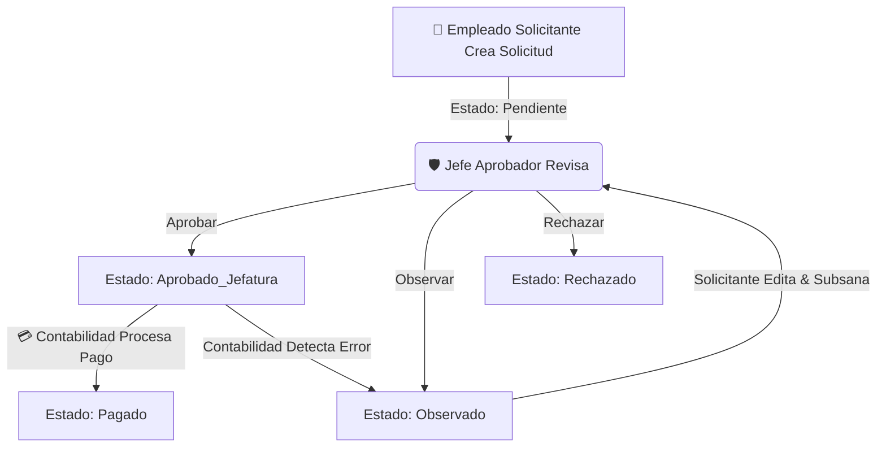

# 🏥 DOCUMENTACIÓN TÉCNICA Y RESUMEN DEL PROYECTO
## Sistema Corporativo de Gestión y Aprobación de Solicitudes de Pago
**Empresas:** Fralak SRL • Dotmed SRL • CID SRL  
**Fecha de Actualización:** 11 de Agosto, 2026  
**Stack Tecnológico:** Laravel 10 + Inertia.js (React 18) + Tailwind CSS + Vite + MySQL/MariaDB

---

## 1. 📌 Descripción General del Sistema

El **Sistema Corporativo de Solicitudes de Pago** es una plataforma web desarrollada para automatizar, controlar y auditar el flujo completo de solicitudes de desembolso de fondos para las empresas **Fralak SRL**, **Dotmed SRL** y **CID SRL**. 

Permite que los empleados de compras y áreas operativas generen solicitudes de pago con respaldos digitales, las cuales pasan por un ciclo de revisión gerencial por jefatura y culminan en el procesamiento del desembolso contable con comprobantes bancarios.

---

## 2. 🏛️ Arquitectura de Roles e Interfaces (Multi-Theme Médico)

Cada rol de usuario cuenta con un **módulo independiente, un controlador dedicado, un layout de navegación personalizado y un esquema visual de estilo médico profesional**:

| Rol | Icono & Módulo | Controller Principal | Layout React | Paleta Visual & Enfoque Médico |
| :--- | :--- | :--- | :--- | :--- |
| **👑 Administrador** | Dirección Médica | `AdminDashboardController` `EmpresaController` `UserController` `ProveedorController` | [`AdminLayout.jsx`](file:///C:/Users/franco/Desktop/sistema_solicitud/sistema_solicitud/resources/js/Layouts/AdminLayout.jsx) | **Cobalto Clínico (`indigo-600`)**<br>Control global de usuarios, roles, empresas, proveedores y auditoría de todas las solicitudes. |
| **🛡️ Jefe Aprobador** | Auditoría Médica | `JefaturaController` | [`JefaturaLayout.jsx`](file:///C:/Users/franco/Desktop/sistema_solicitud/sistema_solicitud/resources/js/Layouts/JefaturaLayout.jsx) | **Violeta Quirúrgico (`violet-600`)**<br>Bandeja de aprobación en 1 clic (*Aprobar*, *Observar*, *Rechazar*) con resumen de montos en BOB/USD. |
| **💳 Contabilidad** | Tesorería Médica | `ContabilidadController` | [`ContabilidadLayout.jsx`](file:///C:/Users/franco/Desktop/sistema_solicitud/sistema_solicitud/resources/js/Layouts/ContabilidadLayout.jsx) | **Esmeralda Quirúrgico (`emerald-600`)**<br>Inspección de cuentas bancarias de proveedores, verificación de facturación y registro de pagos con comprobantes. |
| **📝 Solicitante** | Compras & Insumos | `SolicitanteController` | [`SolicitanteLayout.jsx`](file:///C:/Users/franco/Desktop/sistema_solicitud/sistema_solicitud/resources/js/Layouts/SolicitanteLayout.jsx) | **Cian Diagnóstico (`cyan-600`)**<br>Creación de solicitudes con archivos adjuntos, seguimiento del progreso en tiempo real y subsanación de observaciones. |

---

## 3. 🔄 Máquina de Estados y Ciclo de Vida de las Solicitudes



### Descripción de Estados:
- **`Pendiente`**: Solicitud recién creada por el empleado. En espera de revisión por el Jefe de Área.
- **`Aprobado_Jefatura`**: Solicitud aprobada por la jefatura. Entra automáticamente a la cola de desembolso de Contabilidad.
- **`Pagado`**: Solicitud desembolsada exitosamente por Contabilidad con número de transacción/cheque y nota de pago.
- **`Observado`**: Devuelta con observaciones enviadas por el Jefe o por Contabilidad. El Solicitante la subsana y reenvía, regresando a estado `Pendiente`.
- **`Rechazado`**: Rechazada definitivamente por la jefatura.

---

## 4. 🗂️ Módulo de Empresas Multirrol (Comportamiento Inteligente)

- **Controlador**: [`EmpresaController.php`](file:///C:/Users/franco/Desktop/sistema_solicitud/sistema_solicitud/app/Http/Controllers/EmpresaController.php)
- **Vista React**: [`resources/js/Pages/Admin/Empresas/Index.jsx`](file:///C:/Users/franco/Desktop/sistema_solicitud/sistema_solicitud/resources/js/Pages/Admin/Empresas/Index.jsx)
- **Adaptabilidad por Rol**:
  - Al ingresar a la ruta `/empresas`, la vista detecta automáticamente el rol del usuario autenticado (`auth.user.rol.nombre`) y envuelve el contenido en el Layout correspondiente (`SolicitanteLayout`, `JefaturaLayout`, `ContabilidadLayout` o `AdminLayout`), manteniendo la barra lateral, menú y color de tema propio de su rol.
  - La creación, edición y eliminación de empresas está reservada exclusivamente para el rol de **Administrador**.
- **Logos Institucionales**:
  - Utiliza exclusivamente los logos oficiales **con fondo** (`Logo_Fralak.PNG`, `Logo_Dotmed.png`, `Logo_CID.PNG`) montados dentro de contenedores blancos redondeados (`bg-white rounded-2xl border border-slate-200 shadow-md`).

---

## 5. 🔑 Pantalla de Autenticación (Login)

- **Vista React**: [`resources/js/Pages/Auth/Login.jsx`](file:///C:/Users/franco/Desktop/sistema_solicitud/sistema_solicitud/resources/js/Pages/Auth/Login.jsx)
- **Estructura Visual**:
  1. **Encabezado**: La imagen `/images/Banner.png` cubre la parte superior a todo lo ancho de la pantalla en su tamaño y relación de aspecto natural original (`w-full h-auto block mx-auto`).
  2. **Centro**: Formulario de inicio de sesión con selector rápido para cambiar entre usuarios de prueba demo:
     - 👑 `admin@sistema.com` (password: `admin123`)
     - 👔 `jefe@sistema.com` (password: `password`)
     - 📊 `conta@sistema.com` (password: `password`)
     - 📝 `solicitante@sistema.com` (password: `password`)
  3. **Pie de Página**: Tarjetas con los logos institucionales con fondo (`Logo_Fralak.PNG`, `Logo_Dotmed.png`, `Logo_CID.PNG`).

---

## 6. 📁 Estructura de Archivos Clave del Proyecto

```
sistema_solicitud/
├── app/
│   ├── Http/
│   │   ├── Controllers/
│   │   │   ├── AdminDashboardController.php
│   │   │   ├── ContabilidadController.php
│   │   │   ├── EmpresaController.php
│   │   │   ├── JefaturaController.php
│   │   │   ├── ProveedorController.php
│   │   │   ├── SolicitanteController.php
│   │   │   ├── SolicitudController.php
│   │   │   └── UserController.php
│   ├── Models/
│   │   ├── User.php  (Métodos: esAdmin, esJefe, esContabilidad, esSolicitante)
│   │   ├── Empresa.php
│   │   ├── Proveedor.php
│   │   ├── Solicitud.php
│   │   └── Role.php
├── public/
│   └── images/
│       ├── Banner.png  (Banner principal de encabezado)
│       ├── Logo_Fralak.PNG
│       ├── Logo_Dotmed.png
│       └── Logo_CID.PNG
├── resources/
│   ├── js/
│   │   ├── Layouts/
│   │   │   ├── AdminLayout.jsx
│   │   │   ├── ContabilidadLayout.jsx
│   │   │   ├── JefaturaLayout.jsx
│   │   │   └── SolicitanteLayout.jsx
│   │   ├── Pages/
│   │   │   ├── Admin/
│   │   │   │   └── Empresas/Index.jsx
│   │   │   ├── Auth/
│   │   │   │   └── Login.jsx
│   │   │   ├── Contabilidad/
│   │   │   │   ├── Dashboard.jsx
│   │   │   │   ├── Solicitudes/Index.jsx
│   │   │   │   └── Proveedores/Index.jsx
│   │   │   ├── Jefatura/
│   │   │   │   ├── Dashboard.jsx
│   │   │   │   ├── Solicitudes/Index.jsx
│   │   │   │   └── Proveedores/Index.jsx
│   │   │   └── Solicitante/
│   │   │       ├── Dashboard.jsx
│   │   │       ├── Solicitudes/Index.jsx
│   │   │       └── Proveedores/Index.jsx
│   │   └── Utils/
│   │       └── empresaLogo.js  (Retorna logos oficiales con fondo)
├── routes/
│   └── web.php  (Redirección por rol en /dashboard y grupos protegidos)
└── SQL.sql
```

---

## 7. 🤖 Guía e Instrucciones para Futuras Sesiones de Inteligencia Artificial

Si otra sesión de IA retoma este proyecto, debe considerar lo siguiente:

1. **Compilación en Windows**:
   - Debido a la política de ejecución de scripts en PowerShell en el sistema del usuario, las herramientas de build deben ejecutarse usando `cmd.exe`:
     ```bash
     cmd.exe /c "npm run build"
     ```
2. **Uso de Imágenes**:
   - Las imágenes públicas se sirven directamente desde `public/images/`.
   - **NO** se deben usar los nombres que terminan en `_SF` (sin fondo) para los logos corporativos; se deben usar `Logo_Fralak.PNG`, `Logo_Dotmed.png` y `Logo_CID.PNG`.
3. **Respeto a los Layouts por Rol**:
   - Al agregar o modificar vistas compartidas entre varios roles (ej: Proveedores, Empresas, Solicitudes), se debe utilizar el componente de Layout correspondiente al rol del usuario autenticado para no forzar la vista de Administrador en otros roles.
4. **Verificación Post-Cambios**:
   - Siempre correr `cmd.exe /c "npm run build"` al finalizar modificaciones en archivos JSX/React para asegurar que el bundle compile sin errores de sintaxis o importación.

---
*Documento generado automáticamente para la continuidad y contextualización del desarrollo.*
